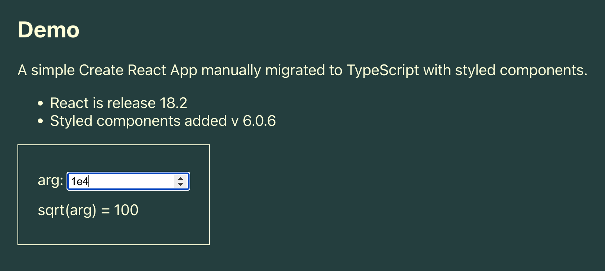

# Simple Create React App Migrated to TypeScript

This project was bootstrapped with [Create React App](https://github.com/facebook/create-react-app).

## What is This?
This is a simple JavaScript React project created by Create React App and then manually migrated to TypeScript.
It interactively calls a TypeScript square root function implementd locally in the application.

